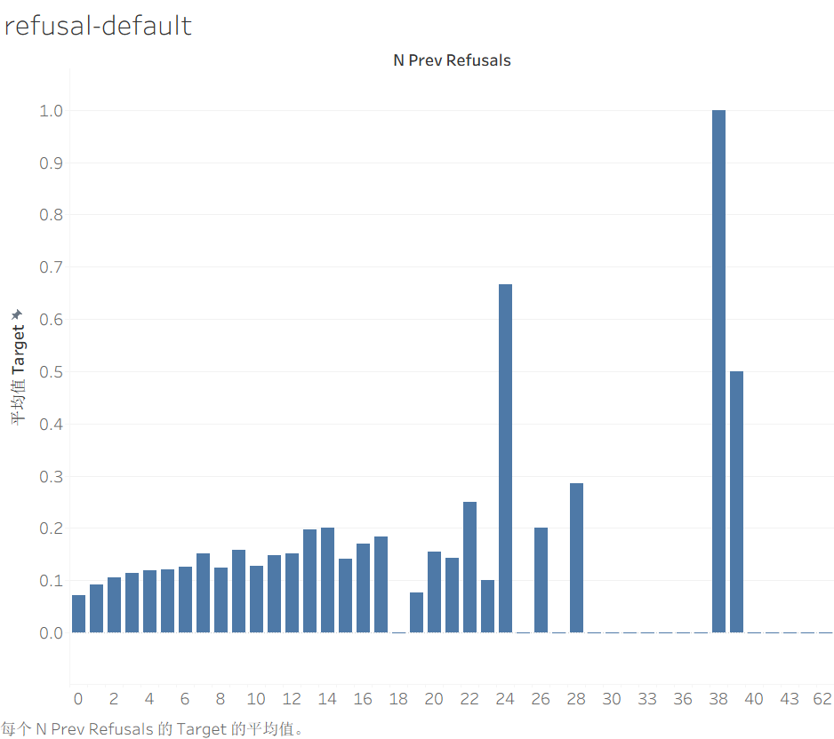
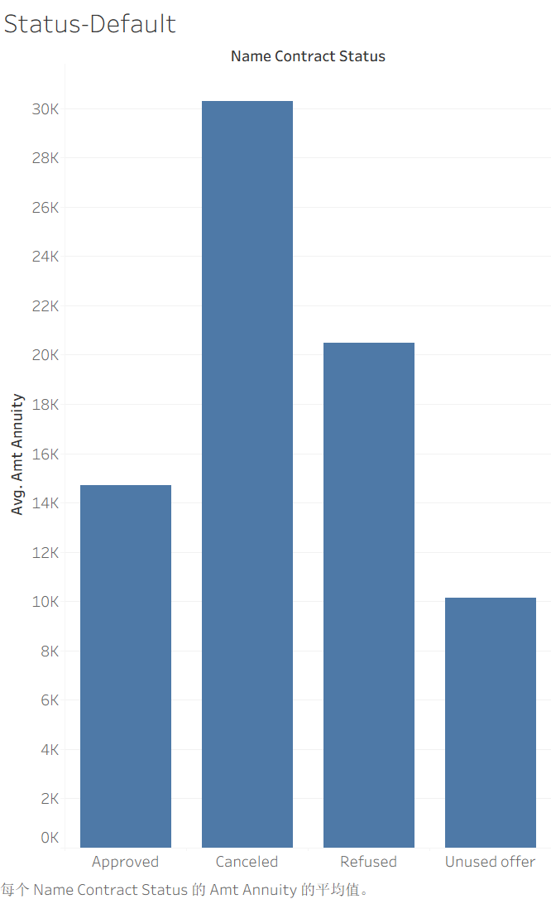

# home-credit-risk-XGBoost
It developed an XGBoost model for credit default prediction, achieving a validation AUC of 0.7626 after applying early stopping.

# Home Credit Default Risk Prediction

## Project Overview
- **Goal**: Predict if a loan applicant will default.
- **Data**: Home Credit dataset from Kaggle.
- **My Approach**: Built an XGBoost model with two new features from previous application data.

## Key Files
- `home_credit_xgboost.ipynb`: The main Python notebook with EDA, feature engineering, and model training.
- `submission.csv`: Final prediction file.
- `sql_queries/`: Feature extraction queries
- `tableau_dashboard.png`: Risk visualization 

## Results
- **Public Leaderboard Score**: `0.74165`
- **Private Leaderboard Score**: `0.74439`

## Key Features Engineered
- `n_prev_refusals`: How many times a client was previously rejected.
- `avg_annuity_prev`: Client's average historical loan annuity.

## Tech Stack
- Python (pandas, XGBoost)
- SQL (for data extraction queries)
- Tableau (for visualization, see `/images` folder)

## Tableau chart - Key Insights from Feature Engineering
### Default Rate by Number of Previous Refusals

**Observations:**
- Clients with **0 previous refusals** → default rate: ~8%
- Clients with **1 previous refusal** → default rate: ~15% (nearly doubled)
- Clients with **2 previous refusals** → default rate: ~20%
- Clients with **5+ previous refusals** → default rate: exceeds 30%

**Business Implication:** 
A client's past refusal count is a strong indicator of future default risk. 
This feature alone contributes significantly to the model's predictive power.

### Average Annuity amount by Contract_Status

**Observations:**
- **Approved** loans have the highest average annuity (~14,500)
- **Canceled** loans show the lowest average annuity (~3,000)
- **Refused** loans have a moderate average annuity (~8,000)
- **Unused offer** loans fall between Approved and Refused (~10,000)

**Business Implication:**
Clients who receive loan approval tend to request (or are granted) higher annuity amounts, reflecting stronger perceived repayment capacity. Conversely, applications with very low annuity are more likely to be canceled, possibly due to insufficient loan size relative to borrower needs. This pattern aligns with standard credit risk logic: higher-risk applicants either request smaller loans or are rejected outright.

## Result
Private Score AUC 0.7612 On Kaggle!
## How to Run
1. Clone this repo.
2. Run the notebook in Kaggle or Jupyter.
